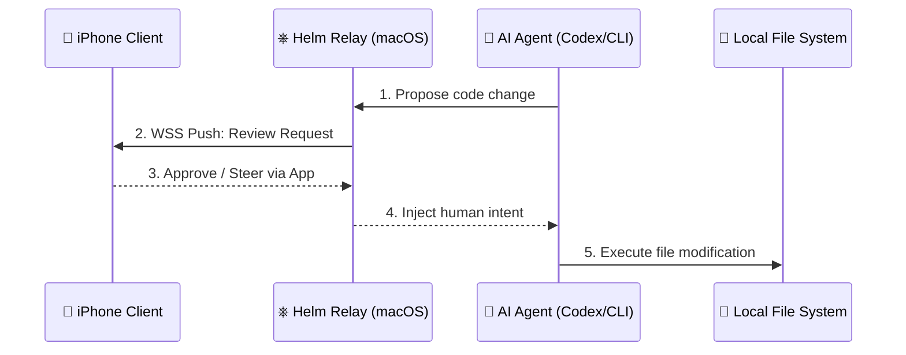
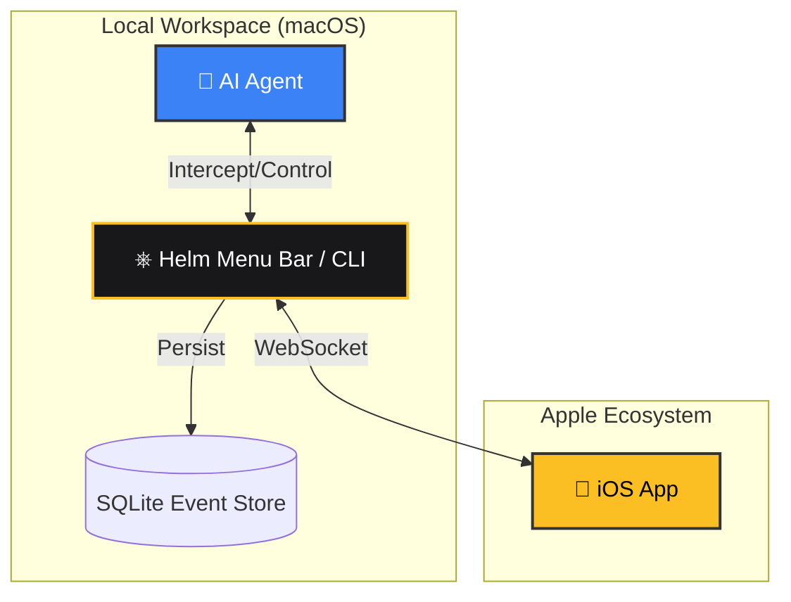

<div align="center">
  <h1>⎈ Helm</h1>
  <p><strong>The Mobile Control Plane for AI Coding Sessions</strong></p>

  [](https://opensource.org/licenses/MIT)
  []()
  []()
  
  <br />
  <a href="https://easonwumac.github.io/HelmSite/" target="_blank">View Official Website</a>
</div>

<br />

> **Helm** connects your iPhone to your running local AI agents (like Codex, Gemini CLI). It allows you to monitor progress, approve file changes, and steer the development direction—all without being chained to your desk.

## 🚀 Why Helm?
Traditional AI coding agents require you to babysit the terminal. Helm solves this by splitting the architecture into a background **Relay** and a **Mobile Client**.

* **📡 Real-time Relay**: Sub-100ms WebSocket relay for local agent events.
* **📱 Live Supervision**: Review conversations, file diffs, and terminal outputs on the go.
* **✅ Remote Approval**: Accept, reject, or steer agent turns directly from iOS.
* **🔒 Secure by Default**: Works exclusively on your local network or via secure tunnels (e.g., Tailscale).

---

## 📊 Architecture

Helm consists of a lightweight macOS host daemon and an iOS companion app.

### 🔄 Event Flow (Sequence)


### 🏗️ System Components


---

## ⚡ Quick Start

### 1. Install the macOS Relay
Install the Helm CLI using Homebrew:
```bash
brew tap easonwumac/tap
brew install helm
```

### 2. Start the Control Plane
Navigate to your project directory and run:
```bash
helm start
```
*This will start the WebSocket server on port 8080 and display a pairing QR code in your terminal.*

### 3. Connect the iOS App
1. Download **Helm** from the App Store (or TestFlight).
2. Scan the QR code generated in your terminal.
3. You're connected! Any agent events in this workspace will now push to your phone.

---

## 🛣️ Roadmap

- [x] Local WSS Relay & iOS Client MVP
- [x] QR Code Pairing
- [x] Basic Turn / Diff visualization
- [ ] Push Notifications via APNs
- [ ] Session History & SQLite Archiving
- [ ] Pattern-based Auto-allow rules
- [ ] Tailscale (Tailnet) native integration

---

## 🤝 Contributing
Contributions, issues, and feature requests are welcome!
Feel free to check [issues page](https://github.com/easonwumac/Helm/issues).

## 📝 License
This project is [MIT](https://opensource.org/licenses/MIT) licensed. Built for the modern AI engineer.
